<!-- GENERATED by scripts/doc-agent.js — do not edit by hand -->
# Dependency Map

Generated 2026-06-26T08:25:57.156Z

Extensions produce variables consumed by other extensions and tags.

```mermaid
graph LR
  E1(["Consent Manager"]) --> V_consent_status["consent_status"]
  E1(["Consent Manager"]) --> V_consent_analytics["consent_analytics"]
  E1(["Consent Manager"]) --> V_consent_marketing["consent_marketing"]
  V_gridbox_data --> E1
  V_tealium_event --> E1
  E2(["GridBox Data Layer Bridge"]) --> V_page_url["page_url"]
  E2(["GridBox Data Layer Bridge"]) --> V_referrer["referrer"]
  E2(["GridBox Data Layer Bridge"]) --> V_browser_language["browser_language"]
  V_gridbox_data --> E2
  V_tealium_event --> E2
  E10(["Data Layer Enrichment"]) --> V_cart_total["cart_total"]
  E10(["Data Layer Enrichment"]) --> V_cart_item_count["cart_item_count"]
  E10(["Data Layer Enrichment"]) --> V_product_id["product_id"]
  E10(["Data Layer Enrichment"]) --> V_product_name["product_name"]
  E10(["Data Layer Enrichment"]) --> V_product_category["product_category"]
  E10(["Data Layer Enrichment"]) --> V_product_brand["product_brand"]
  E10(["Data Layer Enrichment"]) --> V_product_price["product_price"]
  E10(["Data Layer Enrichment"]) --> V_order_id["order_id"]
  E10(["Data Layer Enrichment"]) --> V_order_total["order_total"]
  E10(["Data Layer Enrichment"]) --> V_order_currency["order_currency"]
  E10(["Data Layer Enrichment"]) --> V_search_term["search_term"]
  V_gridbox_data --> E10
  V_tealium_event --> E10
  E11(["Identity Resolver"]) --> V_customer_id["customer_id"]
  E11(["Identity Resolver"]) --> V_customer_email["customer_email"]
  E11(["Identity Resolver"]) --> V_customer_tier["customer_tier"]
  E11(["Identity Resolver"]) --> V_visitor_id["visitor_id"]
  E11(["Identity Resolver"]) --> V_login_status["login_status"]
  V_gridbox_data --> E11
  V_tealium_event --> E11
  E12(["Page Data"]) --> V_page_name["page_name"]
  E12(["Page Data"]) --> V_page_type["page_type"]
  E12(["Page Data"]) --> V_page_category["page_category"]
  E12(["Page Data"]) --> V_site_section["site_section"]
  V_gridbox_data --> E12
  V_tealium_event --> E12
  E20(["GA4 Ecommerce Mapping"]) --> V_ga4_event_name["ga4_event_name"]
  E20(["GA4 Ecommerce Mapping"]) --> V_ga4_items["ga4_items"]
  E20(["GA4 Ecommerce Mapping"]) --> V_ga4_value["ga4_value"]
  E20(["GA4 Ecommerce Mapping"]) --> V_ga4_currency["ga4_currency"]
  E20(["GA4 Ecommerce Mapping"]) --> V_ga4_user_id["ga4_user_id"]
  V_consent_analytics --> E20
  V_customer_id --> E20
  V_product_id --> E20
  V_product_name --> E20
  V_product_price --> E20
  V_cart_total --> E20
  V_order_id --> E20
  V_order_total --> E20
  V_order_currency --> E20
  V_tealium_event --> E20
  E20 --> T_GA4{{"GA4"}}
  E21(["Adobe Data Mapping"]) --> V_adobe_events["adobe_events"]
  E21(["Adobe Data Mapping"]) --> V_adobe_products["adobe_products"]
  E21(["Adobe Data Mapping"]) --> V_adobe_eVar_email["adobe_eVar_email"]
  E21(["Adobe Data Mapping"]) --> V_adobe_eVar_tier["adobe_eVar_tier"]
  E21(["Adobe Data Mapping"]) --> V_adobe_pageName["adobe_pageName"]
  V_consent_analytics --> E21
  V_customer_email --> E21
  V_customer_tier --> E21
  V_customer_id --> E21
  V_product_id --> E21
  V_product_name --> E21
  V_product_price --> E21
  V_page_name --> E21
  V_order_id --> E21
  V_order_total --> E21
  V_tealium_event --> E21
  E21 --> T_AdobeAnalytics{{"AdobeAnalytics"}}
  E22(["Meta Pixel Mapping"]) --> V_meta_event_name["meta_event_name"]
  E22(["Meta Pixel Mapping"]) --> V_meta_content_ids["meta_content_ids"]
  E22(["Meta Pixel Mapping"]) --> V_meta_value["meta_value"]
  E22(["Meta Pixel Mapping"]) --> V_meta_currency["meta_currency"]
  V_consent_marketing --> E22
  V_product_id --> E22
  V_product_price --> E22
  V_order_total --> E22
  V_order_currency --> E22
  V_tealium_event --> E22
  E22 --> T_MetaPixel{{"MetaPixel"}}
  E30(["Scroll & Click Tracking"]) --> V_scroll_depth["scroll_depth"]
  E30(["Scroll & Click Tracking"]) --> V_outbound_link["outbound_link"]
  E30(["Scroll & Click Tracking"]) --> V_cta_clicked["cta_clicked"]
  V_page_name --> E30
  V_tealium_event --> E30
  V_consent_status --> E40
  V_customer_id --> E40
  V_ga4_event_name --> E40
  V_adobe_events --> E40
  V_tealium_event --> E40
```

## Protected / high-impact variables

- **tealium_event** → feeds tags: GA4, AdobeAnalytics, MetaPixel (used by 10 extension(s))
- **product_id** → feeds tags: GA4, AdobeAnalytics, MetaPixel (used by 3 extension(s))
- **product_price** → feeds tags: GA4, AdobeAnalytics, MetaPixel (used by 3 extension(s))
- **order_total** → feeds tags: GA4, AdobeAnalytics, MetaPixel (used by 3 extension(s))
- **consent_analytics** → feeds tags: GA4, AdobeAnalytics (used by 2 extension(s))
- **product_name** → feeds tags: GA4, AdobeAnalytics (used by 2 extension(s))
- **order_id** → feeds tags: GA4, AdobeAnalytics (used by 2 extension(s))
- **order_currency** → feeds tags: GA4, MetaPixel (used by 2 extension(s))
- **customer_id** → feeds tags: GA4, AdobeAnalytics (used by 3 extension(s))
- **consent_marketing** → feeds tags: MetaPixel (used by 1 extension(s))
- **cart_total** → feeds tags: GA4 (used by 1 extension(s))
- **customer_email** → feeds tags: AdobeAnalytics (used by 1 extension(s))
- **customer_tier** → feeds tags: AdobeAnalytics (used by 1 extension(s))
- **page_name** → feeds tags: AdobeAnalytics (used by 2 extension(s))
