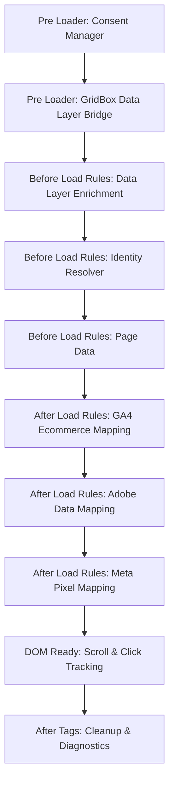

<!-- GENERATED by scripts/doc-agent.js — do not edit by hand -->
# Execution Flow (Load Order)

Generated 2026-06-26T08:25:57.156Z · source: local-manifest

Tealium runs extensions by **scope**, then **order** within scope:

| # | Scope | Order | Extension | Creates | Uses | Risk |
|---|---|---|---|---|---|---|
| 1 | Pre Loader | 1 | Consent Manager 🔒 | consent_status, consent_analytics, consent_marketing | gridbox_data, tealium_event | critical |
| 2 | Pre Loader | 2 | GridBox Data Layer Bridge | page_url, referrer, browser_language | gridbox_data, tealium_event | medium |
| 3 | Before Load Rules | 1 | Data Layer Enrichment | cart_total, cart_item_count, product_id, product_name, product_category, product_brand, product_price, order_id, order_total, order_currency, search_term | gridbox_data, tealium_event | medium |
| 4 | Before Load Rules | 2 | Identity Resolver 🔒 | customer_id, customer_email, customer_tier, visitor_id, login_status | gridbox_data, tealium_event | high |
| 5 | Before Load Rules | 3 | Page Data | page_name, page_type, page_category, site_section | gridbox_data, tealium_event | low |
| 6 | After Load Rules | 1 | GA4 Ecommerce Mapping | ga4_event_name, ga4_items, ga4_value, ga4_currency, ga4_user_id | consent_analytics, customer_id, product_id, product_name, product_price, cart_total, order_id, order_total, order_currency, tealium_event | medium |
| 7 | After Load Rules | 2 | Adobe Data Mapping | adobe_events, adobe_products, adobe_eVar_email, adobe_eVar_tier, adobe_pageName | consent_analytics, customer_email, customer_tier, customer_id, product_id, product_name, product_price, page_name, order_id, order_total, tealium_event | medium |
| 8 | After Load Rules | 3 | Meta Pixel Mapping | meta_event_name, meta_content_ids, meta_value, meta_currency | consent_marketing, product_id, product_price, order_total, order_currency, tealium_event | medium |
| 9 | DOM Ready | 1 | Scroll & Click Tracking | scroll_depth, outbound_link, cta_clicked | page_name, tealium_event | low |
| 10 | After Tags | 1 | Cleanup & Diagnostics | — | consent_status, customer_id, ga4_event_name, adobe_events, tealium_event | low |

## Sequence

